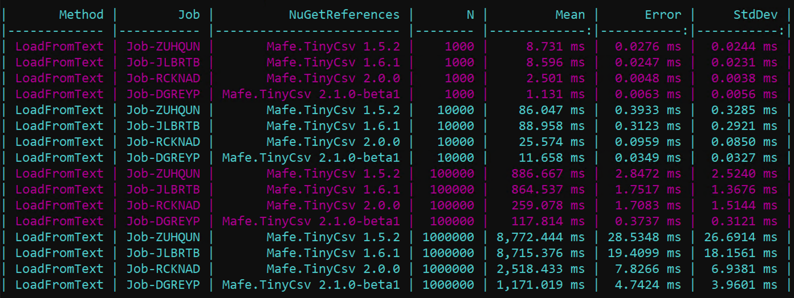

# TinyCsv

TinyCsv is a .NET library to read and write CSV data in an easy way.

To use it in your project, add the Mafe.TinyCsv NuGet package to your project.

[](https://www.nuget.org/packages/Mafe.TinyCsv/2.2.1)


It is available an AspNetCore extension:

[](https://www.nuget.org/packages/Mafe.TinyCsv.AspNetCore/1.0.0)


Define the model that you want to use, like this:

```c#
public class Model
{
    public int Id { get; set; }
    public string Name { get; set; }
    public decimal Price { get; set; }
    public DateTime CreatedOn { get; set; }
    public string TextBase64 { get; set; }
}
```

Now, it is necessary to define the TinyCSV options, like this:

```c#
var csv = new TinyCsv<Model>(options =>
{
    // Options
    options.HasHeaderRecord = true;
    options.Delimiter = ";";
    options.RowsToSkip = 0;
    options.SkipRow = (row, idx) => string.IsNullOrWhiteSpace(row) || row.StartsWith("#");
    options.TrimData = true;
    options.AllowRowEnclosedInDoubleQuotesValues = true;
    options.EnableHandlers = false;
    options.ValidateColumnCount = true;

    // Columns
    options.Columns.AddColumn(m => m.Id);
    options.Columns.AddColumn(m => m.Name);
    options.Columns.AddColumn(m => m.Price);
    options.Columns.AddColumn(m => m.CreatedOn, "dd/MM/yyyy");
    options.Columns.AddColumn(m => m.TextBase64, new Base64Converter());
});
```

The options defines that the file has the header in first row and the delimier char is ";", furthermore there are defined some columns.
RowsToSkip and SkipRow are used to skip the first rows of the file.
TrimData is used to remove the white spaces from the data.

The rows starting with the `Comment` char (`#` by default) are skipped when `AllowComment` is true (default),
while `AllowComment = false` throws a `NotAllowCommentException`.
The `TextEncoding` option (UTF-8 by default) is used to read and write files, streams and text; a byte order mark, if present, takes precedence while reading.

## Quoted values and multi-line records

TinyCsv follows [RFC 4180](https://www.rfc-editor.org/rfc/rfc4180):

- a value is quoted (`"..."`) when it contains the delimiter, a quote or a new line;
- a quote inside a quoted value is escaped by doubling it (`""`);
- a quoted value can span multiple lines: the whole record is **one row**, for `RowsToSkip`, `SkipRow`, the events and `GetAllLines*`.

```csv
Id;Name;Note
1;"Rossi; Mario";"He said ""hello"""
2;Luigi;"first line
second line"
```

The file above contains 2 rows. `Save` escapes the values in the same way, so a saved file is always read back as it is.

## Breaking changes in 3.0

TinyCsv 3.0 has a new reader, based on `Span<char>`, that reads a CSV record instead of a physical line.
It is faster and allocates less memory, and it fixes the parsing of quoted values.
Some behaviours changed, please check them when you upgrade from 2.x:

| Area | 2.x | 3.0 |
|---|---|---|
| Quoted value on multiple lines | split in two broken rows | one row, the new lines are kept in the value |
| Doubled quotes `""` in a quoted value | not always unescaped (`"";x` was read as `;x`) | unescaped to `"` |
| Quote in the middle of an unquoted value (`5" pipe`) | removed | kept |
| `"` and `'` at the start/end of a value | always removed | only the enclosing quotes of a quoted value are removed |
| `TrimData` on a quoted value | trimmed inside the quotes | the spaces inside the quotes are kept |
| Rows starting with `#` (the `Comment` char) with `AllowComment = true` | read as data | skipped. Change `Comment` if your data starts with `#` |
| `EndOfLineDelimiterChar = false` | the last value of the row was lost | the last value is read, a trailing delimiter throws |
| Empty last value (`1;Mario;` with 3 columns) | `null` | empty string |
| Empty line without `SkipRow` | `IndexOutOfRangeException` | a model with default values |
| `SkipRow` index with `RowsToSkip` | inconsistent (and different between sync and async) | the record index, starting from 0 |
| `GetAllLinesAndFields*` | always empty arrays | the values of each row |
| `Save`/`GetAllText` of values with quotes or new lines | not escaped, the file could not be read back | escaped as RFC 4180 (with `AllowBackSlashToEscapeQuote`, quotes and backslashes are escaped with `\`) |
| `TextEncoding` | ignored while reading | used to read and write |
| `[TextEncoding]` attribute | could not be used as attribute | `[TextEncoding("utf-16")]` or `[TextEncoding(1200)]` |
| `DoubleQuotes` option | ignored | used as quote char |
| `LoadFromFile`, `Save` and the other methods with a path | the file was not closed | the file is closed |
| `[Column(name: "...")]` | `KeyNotFoundException` | the name is used for the header, the value is mapped to the property |
| Nullable enum properties | `ArgumentException` | supported |
| Unknown enum value | `null` | the default enum value |
| `ToListAsync()` on .NET 10 | ambiguous with `System.Linq.AsyncEnumerable.ToListAsync` | TinyCsv's extension is not defined on .NET 10, the BCL one is used |

Furthermore:

- added the `net10.0` target;
- `netstandard2.0` and `net462`-`net48` depend on `System.Memory`.

## Custom Value Converter

It is possible to define a custom converter for a column, like this:

```c#
public class Base64Converter : IValueConverter
{
    public string Convert(object value, object parameter, IFormatProvider provider) 
        => Base64Encode($"{value}");

    public object ConvertBack(string value, Type targetType, object parameter, IFormatProvider provider) 
        => Base64Decode(value);

    private string Base64Encode(string plainText)
    {
        var plainTextBytes = System.Text.Encoding.UTF8.GetBytes(plainText);
        return System.Convert.ToBase64String(plainTextBytes);
    }

    private string Base64Decode(string base64EncodedData)
    {
        var base64EncodedBytes = System.Convert.FromBase64String(base64EncodedData);
        return System.Text.Encoding.UTF8.GetString(base64EncodedBytes);
    }
}
```

Base64Converter is used to convert the data column to a base64 string and vice versa for TextBase64 column.

A column is defined with the model's property only. The library get or set the value in automatically.

## Read

To read a csv file is only necessary invoke the load method, like this:

```c#
var models = csv.LoadFromFile("file.csv");
foreach(var model in models){
    // processing
}
```

or you can to use the asynchronously method, like this:

```c#
var models = await csv.LoadFromFileAsync("file.csv");
await foreach(var model in models){
    // processing
}
```

for NET5_0_OR_GREATER or NETSTANDARD2_1_OR_GREATER, like this:

```c#
var models = await csv.LoadFromFileAsync("file.csv").ToListAsync();
```

The load method returns a collection of Model type items and takes as argument the file's path.

## Write

To write a csv file is only necessary invoke the Save method, like this:

```c#
csv.Save("file_export.csv", models);
```

or you can to use the asynchronously method, like this:

```c#
await csv.SaveAsync("file_export.csv", models);
```

The save method takes the file's path and a collection of Model type.
The method saves the file.

## Event handlers

It's possible to define event handlers for the events of the library, like this:

```c#
options.Handlers.Read.RowHeader += (s, e) => Console.WriteLine($"Row header: {e.RowHeader}");
options.Handlers.Read.RowReading += (s, e) => Console.WriteLine($"{e.Index}-{e.Row}");
options.Handlers.Read.RowRead += (s, e) => Console.WriteLine($"{e.Index}-{e.Model}");
```

and the write handlers are:

```c#
options.Handlers.Write.RowHeader += (s, e) => Console.WriteLine($"Row header: {e.RowHeader}");
options.Handlers.Write.RowWriting += (s, e) => Console.WriteLine($"{e.Index} - {e.Model}");
options.Handlers.Write.RowWrittin += (s, e) => Console.WriteLine($"{e.Index} - {e.Row}");
```

The handlers are enabled if the option "EnableHandlers" is set true value, like this:

```c#
var csv = new TinyCsv<Model>(options =>
{
    // Options
    // ...
    options.EnableHandlers = true;
    //...

    // Columns
    // ...
});
```
## Using attributes in the model definition

You can use, in alternative way, the attributes in the model definition, like this:

```c#
[Delimiter(";")]
[RowsToSkip(0)]
[SkipRow(typeof(CustomSkipRow))]
[TrimData(true)]
[ValidateColumnCount(true)]
[HasHeaderRecord(true)]
public class AttributeModel
{
    [Column]
    public int Id { get; set; }

    [Column]
    public string Name { get; set; }

    [Column]
    public decimal Price { get; set; }

    [Column(format: "dd/MM/yyyy")]
    public DateTime CreatedOn { get; set; }

    [Column(converter: typeof(Base64Converter))]
    public string TextBase64 { get; set; }

    public override string ToString()
    {
        return $"ToString: {Id}, {Name}, {Price}, {CreatedOn}, {TextBase64}";
    }
}

class CustomSkipRow : ISkipRow
{
    public Func<string, int, bool> SkipRow { get; } = (row, idx) => string.IsNullOrWhiteSpace(row) || row.StartsWith("#");
}

class Base64Converter : IValueConverter {
    ...
}

```

and you can use it, like this

```c#
 var csv = new TinyCsv<AttributeModel>();
```

## Performance




## TinyCsv.AspNetCore Extensions

Is available the Mafe.TinyCsv.Extensions library to use the TinyCsv in your project and it is downloadable in the NuGet package.

[](https://www.nuget.org/packages/Mafe.TinyCsv.AspNetCore/1.0.0)


It's possible to use the extensions methods in your project, like this:

```c#
var builder = WebApplication.CreateBuilder(args);

builder.Services.AddTinyCsv<Model1>("Model1", options =>
{
    // Options
    options.HasHeaderRecord = true;
    options.Delimiter = ";";
    options.SkipRow = (row, idx) => string.IsNullOrWhiteSpace(row) || row.StartsWith("#");
   
    // columns
    options.Columns.AddColumn(m => m.Id);
    options.Columns.AddColumn(m => m.Name);
    options.Columns.AddColumn(m => m.Price);
});

var app = builder.Build();

app.MapGet("/csv1", [AllowAnonymous] async (ITinyCsvFactory tinyCsvFactory) =>
{
    var tinyCsv = tinyCsvFactory.Get<Model1>("Model1");
    var result = await tinyCsv.LoadFromFileAsync("model1.csv");
    Console.WriteLine($"{result?.Count()}");
    return result;
});

app.MapGet("/csv2", [AllowAnonymous] async (ITinyCsvFactory tinyCsvFactory) =>
{
    var tinyCsv = tinyCsvFactory.Create<Model2>(options =>
    {
        options.HasHeaderRecord = true;
        options.Delimiter = ";";
        options.SkipRow = (row, idx) => string.IsNullOrWhiteSpace(row) || row.StartsWith("#");
        options.Columns.AddColumn(m => m.Id);
        options.Columns.AddColumn(m => m.Name);
    });
    var result = await tinyCsv.LoadFromFileAsync("model2.csv");
    Console.WriteLine($"{result?.Count()}");
    return result;
});

app.Run();
```

The AddTinyCsv method extension takes the name of the model (the name is a unique key)
and the options. The method defines a TinyCsv instance.

The specific model is retriving with the Get method, like this:

```c#
var tinyCsv = tinyCsvFactory.Get<Model1>("Model1");
```

The library is very very simple to use.
